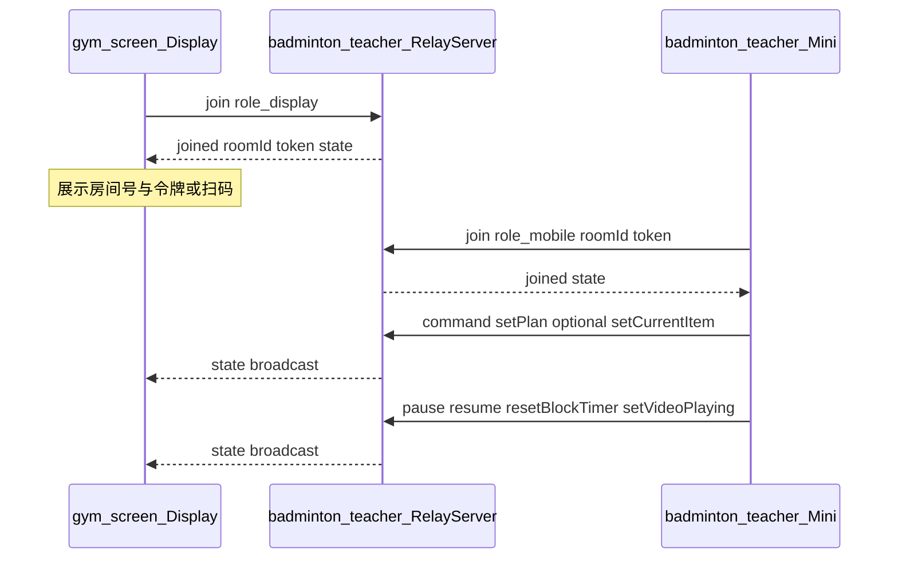

# 小程序远程控制 gym_screen 大屏（修订）

## 原则

- **[control-screen](e:/badminton_new/badminton-teacher/control-screen)** 仅作**参考**（协议形态、房间模型、命令命名可参考 [server/src/index.ts](e:/badminton_new/badminton-teacher/control-screen/server/src/index.ts)、[shared/stateLogic.ts](e:/badminton_new/badminton-teacher/control-screen/shared/stateLogic.ts) 等）。**交付代码不修改 control-screen 仓库**；在 **badminton-teacher** 侧**重新实现**中继与小程序能力。
- **大屏**仍为 **gym_screen**（Vue），需自行实现 **display** 端 WebSocket 客户端与 UI 绑定，连接 badminton-teacher 内的中继服务。

## 现状与缺口（不变部分）

- **小程序**：[training-plan-select.vue](e:/badminton_new/badminton-teacher/badminton-teacher/pages/training-plan-select/training-plan-select.vue) 确认计划后 TODO，未跳转控制页。当前小程序**不包含** `material-manage` 页面；教学资料能力在**大屏控制流程**中直接调接口即可，无需依赖该页面。
- **gym_screen**：当前为 mock 计时与未接线的 `TeachingVideo`（[WorkingStatus.vue](e:/badminton_new/badminton-teacher/gym_screen/src/views/WorkingStatus.vue)）。

## 教学资料接口（以你提供的为准）

与 `admin-api` 前缀及鉴权头（如 `Authorization`、`Tenant-Id`）与现有小程序其它 teaching 接口保持一致。

### 1. 教学计划下全部资料

- **路径**：`GET /teaching/plan-material/list-by-plan`
- **Query**：`planId`（教学计划 id）
- **响应**（`code === 0` 时 `data` 为数组），元素字段示例：

```json
{
  "id": 0,
  "planId": 0,
  "materialType": 0,
  "materialTypeText": "",
  "imageUrl": "",
  "videoUrl": "",
  "duration": 0,
  "title": "",
  "description": "",
  "sortOrder": 0,
  "createTime": "",
  "updateTime": ""
}
```

### 2. 单条资料详情

- **路径**：`GET /teaching/plan-material/get`
- **Query**：`id`（资料 id）
- **用途**：列表项信息不足时（或需完整字段/一致性校验）再拉取；若 `list-by-plan` 已含播放所需 `videoUrl` 等，可按实现需要决定是否对每个条目调用 `get`。

### 与 `setPlan` 的衔接（实现注意）

- 训练项列表来自 **`GET /teaching/plan-project/list-by-plan`**（query：`planId`，与现有 [training-plan-select.vue](e:/badminton_new/badminton-teacher/badminton-teacher/pages/training-plan-select/training-plan-select.vue) 一致）；资料来自 **`GET /teaching/plan-material/list-by-plan`**（query：`planId`）。二者在内存中合并为 relay 的 `setPlan` 载荷：`PlanItem.id` 建议与训练项 `id` 一致（字符串化），`title` / `durationMin` 来自训练项；**`videoUrl`**：在资料 `data` 中按规则选取（例如资料项若含关联训练项字段则按项匹配；否则与产品约定「`sortOrder` 与训练项顺序对应」或「每条训练项选用 plan 下某条 `materialType` 为视频且 `videoUrl` 非空的资料」等）。**以接口真实返回字段为准**。

## 目标交互



## 一、badminton-teacher：新建中继与状态机（核心增量）

在 **badminton-teacher 仓库内**新增独立目录（建议名 **`relay-server/`** 或与小程序同级的 `packages/relay-server`，以实际仓库结构为准）：

- **技术栈**：Node.js + `ws`（或等价），监听端口可配置（参考默认 3456）。
- **行为**（与参考实现对齐即可，代码手写/适度复制到本目录，**不要**把运行依赖指向 control-screen 源码树）：
  - 消息外壳：`join`（`role: display | mobile`；mobile 带 `roomId` + `token`）与 `command`（`name` + `payload`）；下行 `joined` / `state` / `error`。
  - **房间**：display 首次连接创建 `roomId`、`token`、内存中的 `SessionState`、客户端集合；广播统一状态。
  - **计时**：服务端定时器对房间内 `SessionState` 做 tick（暂停时不推进），与参考 [index.ts setInterval](e:/badminton_new/badminton-teacher/control-screen/server/src/index.ts) 行为一致。
- **状态与命令**：在 relay-server 内维护 **自有的** `SessionState` / `PlanItem` / `applyCommand` / `parseWireCommand`（可参考 control-screen 的语义重新实现）。至少支持：
  - 已有语义：`pause`、`resume`、`setCurrentItem`、`resetBlockTimer`、`setVideoPlaying` / `toggleVideo` 等（按需裁剪）。
  - **必增**：`setPlan`（payload：`plan` 数组 + `currentItemId`），`PlanItem` 含 `id`、`title`、`durationMin`，以及 **`videoUrl?`、`instruction?`**，用于大屏视频与说明文案。
- **文档**：在 `relay-server/README.md`（或 badminton-teacher 根 README 一节）写明启动命令、端口、局域网部署注意、与小程序 socket 合法域名关系。

**说明**：若团队希望与参考项目二进制兼容，可有意识对齐消息 JSON 字段名；但维护边界是 **本仓库自洽**，不依赖 control-screen 构建产物。

## 二、gym_screen：大屏端

- **环境变量**：如 `VITE_RELAY_WS` 指向 **badminton-teacher relay-server** 暴露的 `ws://` 地址（非 control-screen 路径）。
- **Pinia + composable**：实现 display 侧连接、`applyRemoteState`；**relay 已连接时禁用组件内本地 `useIntervalFn` 计时**，仅渲染服务端下发的 `sessionElapsedSec`、`blockRemainingSec`、`paused` 等。
- **组件**：[TeachingPlan.vue](e:/badminton_new/badminton-teacher/gym_screen/src/components/TeachingPlan.vue)、[CurrentTraining.vue](e:/badminton_new/badminton-teacher/gym_screen/src/components/CurrentTraining.vue)、[TeachingVideo.vue](e:/badminton_new/badminton-teacher/gym_screen/src/components/TeachingVideo.vue) 在 relay 模式下绑定 store；视频由 `videoPlaying` 驱动 `play`/`pause`（实现思路可参考 control-screen 的 Display 页，**代码在 gym_screen 重写**）。
- **WorkingStatus**：挂载连接、展示房间号/令牌（二维码可二期）。

## 三、badminton-teacher 小程序：遥控端

- [pages.json](e:/badminton_new/badminton-teacher/badminton-teacher/pages.json) 注册 `pages/screen-control/screen-control`（路径可微调）。
- [training-plan-select.vue](e:/badminton_new/badminton-teacher/badminton-teacher/pages/training-plan-select/training-plan-select.vue)：`confirmPlan` 后 `navigateTo` 传入 `lessonId`、`planId`、标题等。
- **控制页**：`uni.connectSocket` 连接 **自建 relay**；`join` mobile；REST：**训练项**（现有按计划接口）+ **`/teaching/plan-material/list-by-plan?planId=`**（必要时再 **`/teaching/plan-material/get?id=`**）合并后组装 **`setPlan`**；按钮映射：`resume` / `pause` / `resetBlockTimer` / `setCurrentItem` / `setVideoPlaying` / `toggleVideo`；结束建议 `pause` + `setVideoPlaying: false`。
- **配置**：小程序后台配置 socket 合法域名；中继地址可常量 + 本地存储，与 REST `BASE_URL` 同机不同端口时注意文档说明。

## 命令映射（与上一版一致，实现落点在 relay-server）

| 用户操作 | wire |
|-----------|------|
| 开始训练 | `resume` |
| 暂停训练 | `pause` |
| 重置当前项目计时 | `resetBlockTimer` |
| 结束训练 | `pause` + `setVideoPlaying` false |
| 切换训练项目 | `setCurrentItem` `{ id }` |
| 播放/暂停视频 | `setVideoPlaying` / `toggleVideo` |

## 验证建议

1. 启动 **badminton-teacher 仓库内的 relay-server**。
2. gym_screen 配置 `VITE_RELAY_WS`，浏览器打开大屏页，确认房间号/令牌。
3. 小程序控制页连接同一中继，下发 `setPlan` 与操控，确认 gym_screen 同步。
4. 错误 token、断连提示可读。

## 范围说明

- **control-screen**：不修改、不作为运行依赖；仅作阅读参考。
- **后端 REST**：沿用现有 admin-api；视频 URL 鉴权问题另任务处理。
