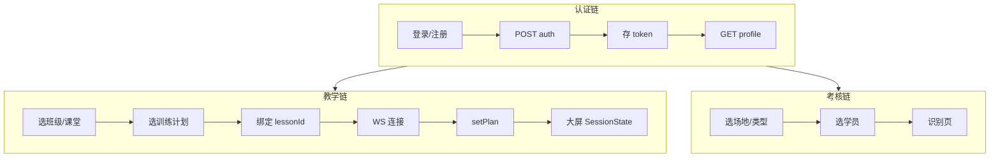
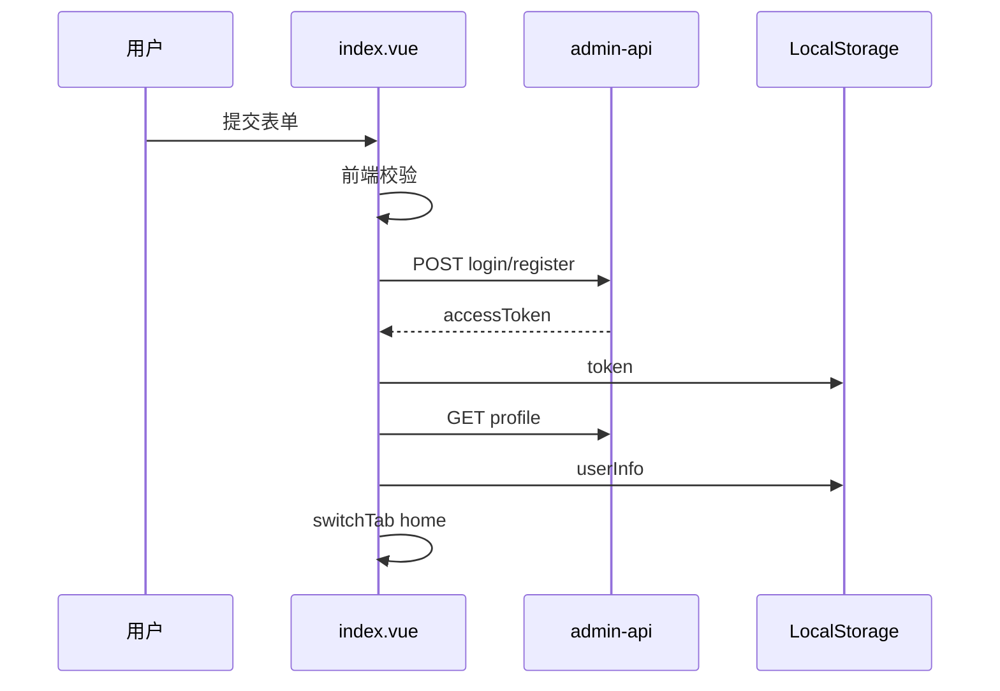
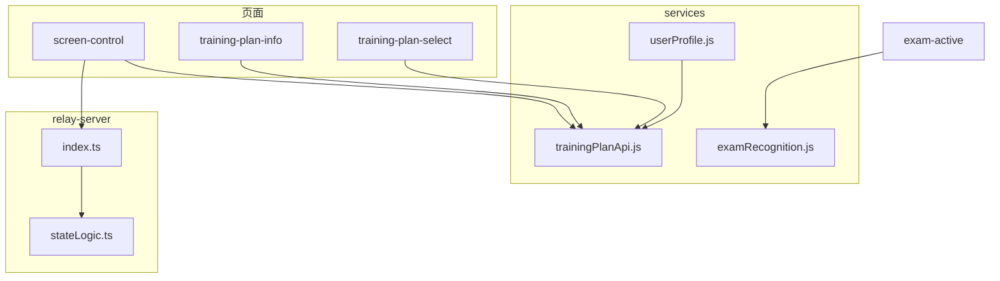

# badminton-teacher 详细说明文档

> 羽毛球教学教师端微信小程序（uni-app + Vue）及配套 relay-server 的详细设计说明。  
> 文档结构：功能描述 → 输入数据 → 输出数据 → 算法与流程 → 函数说明。  
> **考试模式阶段一**（建考配置、旁路 48081）以 [`考试模式三阶段设计.md`](./考试模式三阶段设计.md)、[`考试模式阶段一对接说明.md`](./考试模式阶段一对接说明.md)、[`考试模式旁路后端与联调.md`](./考试模式旁路后端与联调.md) 为准；下文 §1.3.5 / 考核链若与之不一致，以考试三份文档为准。

---

## 1. 功能描述

### 1.1 系统定位

**badminton-teacher** 面向羽毛球教练/教师的移动端工具，与管理后台（admin-api）、训练大屏（control-screen）、WebSocket 中继（relay-server）协同，完成「选课上课 → 制定训练 → 现场教学/考核 → 大屏遥控」的教学闭环。

| 层级 | 技术 |
|------|------|
| 前端 | 微信小程序（uni-app + Vue 3） |
| 业务数据 | HTTP → 管理后台 `/admin-api` |
| 大屏同步 | relay-server（WebSocket，默认端口 3456） |
| 智能考核 | 外部动作识别 / 落点检测 HTTP 服务 |

### 1.2 导航结构（TabBar）

| Tab | 页面 | 功能 |
|-----|------|------|
| 首页 | `pages/home/home` | 按课程分组展示班级，选择班级上课 |
| 我的课程 | `pages/my-courses/my-courses` | 创建、查看课程 |
| 训练计划 | `pages/training-plan/training-plan` | 管理训练计划与项目编排 |
| 我的 | `pages/me/me` | 个人资料、退出登录 |

登录页 `pages/index/index` 为应用入口（非 Tab）。

### 1.3 分模块业务功能

#### 1.3.1 账号与教师中心

- 教师登录、注册（JWT 鉴权，对接 `POST /system/auth/login`、`teacher-register`）
- 个人资料查看（`GET /system/user/profile/get`）
- 退出登录（清除本地 `token`、`userInfo`）

#### 1.3.2 课程与班级管理

- **我的课程**：创建课程（名称、班级名、学期、上课时间）
- **首页**：`list-by-teacher` + `list-classes` 聚合展示；点击进入班级详情
- **班级详情**：查看学生人数；分流「上课」与「考试」
- **课堂列表 / 创建课堂**：按周次管理课次；删除课次

#### 1.3.3 训练计划管理

- 创建、编辑训练计划（常规/专项/测试；难度；时长）
- **训练项目编排**：添加/排序/删除项目（基础/强化/考核）
- **资料管理**：为项目上传图片/视频教学素材
- **课中选择计划**：将计划绑定到当前课堂（`PUT plan/update` 写 `lessonId`）

#### 1.3.4 现场教学与大屏遥控

- 选定课堂与训练计划后进入 **大屏遥控**
- 通过 WebSocket 连接 relay-server，下发 `PlanItem[]` 至大屏
- 手机端控制：开始/暂停、切换项目、重置计时、视频播放、结束训练

#### 1.3.5 考核（阶段一已切到考试头表）

- **考试列表 / 新建考试**：班级详情「考试」进入 `exam-list`；关联 `type=2` 考试课堂与 `scoreRatio`（旁路 `teaching_exam`）
- **考核项与资料**：`exam-items` / `exam-item-edit`；资料选填，上传见联调文档
- **旧壳页** `exam-setup` / `exam-session` / `exam-active` 仍保留，阶段二/三再替换；主入口不再走「选场地 + 写死考核类型」

旧描述中的「场地 picker + 直连算法」仅适用于未迁移的旧页。

### 1.4 典型使用场景

1. 教师登录 → 首页选班级 → 课堂列表选课次 → 选择训练计划并绑定 → 大屏遥控上课。  
2. 训练计划 Tab 独立建计划、编排项目、上传资料 → 课中再选用该计划。  
3. 班级详情 → 考试 → 考试列表 → 新建考试（选考试课堂、占比）→ 配置考核项与可选资料。进入考场为阶段二。

---

## 2. 输入数据

### 2.1 输入设备与形态总览

| 输入设备 | 使用场景 |
|---------|---------|
| 触摸屏软键盘 | 账号、密码、课程名、计划标题、项目名等 |
| 触摸点选 | 列表卡片、TabBar、考核类型、学员选择 |
| `picker` | 学期、周次、日期时间、计划类型/难度、场地、资料类型 |
| 相册/文件 | `uni.chooseImage` / `uni.chooseVideo` |
| 微信授权（占位） | `uni.login`，未对接后端 |
| WebSocket | 大屏遥控：房间号、令牌、控制命令 |
| 路由参数 / 本地存储 | 跨页 `courseId`、`lessonId` 等；`token`、`userInfo`、`relayWs` |

校验分三层：**页面级**（Toast 拦截）→ **服务封装级**（`trainingPlanApi.js`）→ **后端/中继级**（HTTP `code≠0`、WS `error`）。

### 2.2 分模块输入与校验规则

#### 2.2.1 登录 / 注册（`pages/index/index.vue`）

| 字段 | 输入方式 | 前端校验 | 后端约束（API） |
|------|---------|---------|----------------|
| `username` | 文本，`maxlength=30` | 非空 | `AuthLoginReqVO.username` 必填 |
| `password` | 密码框 | 非空；注册时与确认密码一致 | `password` 必填 |
| `nickname` | 注册，`maxlength=30` | 注册模式非空 | `nickname` 必填 |
| `mobile` | 注册，`maxlength=11` | 非空（无号段正则） | `mobile` 必填 |
| `Tenant-Id` | 固定 `'1'` | — | 请求头必填 |

#### 2.2.2 创建课程（`pages/my-courses/my-courses.vue`）

| 字段 | 校验 |
|------|------|
| `name`、`courseClass` | `trim()` 后非空 |
| `semester` | 必选（picker） |
| `startTime`、`endTime` | 必选（未校验结束晚于开始） |
| `teacherId`、`token` | 创建前须存在 |

#### 2.2.3 创建课堂（`pages/lesson-create/lesson-create.vue`）

| 字段 | 校验 |
|------|------|
| `weekIndex` | `weekIndex !== -1`（第 1–16 周） |
| `startTime`、`endTime` | 非空 |
| `courseId` | 路由带入，写入 body |

#### 2.2.4 训练计划（`pages/training-plan-info`）

| 字段 | 校验 / 枚举 |
|------|------------|
| `planTitle` | `trim()` 非空 |
| `planContent` | 选填 |
| `planType`、`difficulty` | picker → `1–3` |
| `duration` | 无效或 ≤0 时默认 60 |
| `lessonId`/`courseId` | 从课堂进入时 `>0` 才写入 |

#### 2.2.5 训练项目与资料

| 场景 | 校验 |
|------|------|
| 新建项目（`training-plan-projects`） | `itemName` 非空；须选资料文件 `materialTempPath` |
| 编辑项目（`plan-project-edit`） | `itemName` 非空；`form.id > 0` |
| 资料管理（`material-manage`） | 路由 `planId`、`itemId` 均 `>0`；上传前 `tempFilePath` 非空 |

#### 2.2.6 考核流程

| 阶段 | 输入 | 校验 |
|------|------|------|
| exam-setup | 场地 picker、考核类型点选 | `lessonId`、`venueId`、`examType`；跳转前 `courseId`、`classId` 非 0 |
| exam-session | 学员单选 | `classId` 有效；开始考核前参数齐全且已选学员 |
| exam-active | 路由参数全集 | `classId`、`courseId`、`lessonId`、`venueId`、`examType`、`classStudentId` 均有效 |
| 动作识别测试 | `chooseVideo`（相册，`maxDuration=300`） | 须获得 `tempFilePath` |

#### 2.2.7 大屏遥控（`pages/screen-control`）

| 字段 | 校验 |
|------|------|
| `relayWs` | 连接前 `trim()` 非空 |
| `roomId`、`token` | 正则 `/^\d{4}$/` |
| `planId` | 下发计划须 `>0` |

**中继命令 payload**（`parseWireCommand`）：如 `setCurrentItem` 要求 `id: string`；`setPlan` 要求非空 `plan` 数组且每项含合法 `id`、`title`、`durationMin`。

### 2.3 本地存储输入键

| 键名 | 含义 |
|------|------|
| `token` | JWT 访问令牌 |
| `userInfo` | 教师资料缓存 |
| `relayWs` / `relayRoomId` / `relayToken` | 中继连接凭证 |

### 2.4 物理表读条件（数据获取）

> 仓库无完整 DDL；表名来自 API 文档明示及 REST 资源惯例推断。

| 物理表（明示/推断） | 接口 | 查询条件 |
|-------------------|------|---------|
| `system_users` | `list-by-teacher`、`profile/get` | `teacherId = 当前用户 id`；profile 按 token |
| `teaching_course` | `course/list-by-teacher`、`course/get` | `teacher_id`；`id = courseId` |
| `teaching_course_class`（视图/关联） | `course/list-classes` | `course_id = courseId` |
| `teaching_lesson` | `course/list-lessons` | `course_id = courseId` |
| `teaching_class_student` | `class-student/list-by-class` | `class_id = classId` |
| `teaching_plan` + 计划-课堂关联 | `plan/list-by-teacher`、`plan/get`、`plan/update` | `teacher_id`；`id`；绑定写 `lesson_id` |
| `teaching_plan_project` | `plan-project/list-by-*` | `teacher_id` 或 `plan_id` |
| `teaching_plan_material` | `plan-material/list-by-item` | `plan_id` + `item_id` |

所有管理端请求携带 `Authorization: Bearer {token}`、`Tenant-Id: 1`。

---

## 3. 输出数据

### 3.1 输出形态总览

| 形态 | 说明 | 载体 |
|------|------|------|
| 持久化 | 跨会话 | `uni.setStorageSync`：`token`、`userInfo`、中继凭证 |
| 管理后台写入 | 业务落库 | HTTP `POST/PUT/DELETE`，`{ code, msg, data }` |
| 页面内状态 | 单会话 UI | Vue `ref` / `reactive` |
| 跨页传递 | 流程上下文 | `navigateTo` query（URL 编码） |
| 实时同步 | 大屏会话 | WebSocket `joined` / `state` / `error` |
| 反馈提示 | 操作结果 | Toast、Modal、Loading |
| 外部服务 | 算法任务 | `request_id`、`status`、`result_url` |

统一成功约定：HTTP `code === 0`；创建类接口 `data` 常为 **Long 型新 id**。

### 3.2 分模块输出与表现形式

#### 3.2.1 登录 / 注册

| 输出 | 表现形式 |
|------|---------|
| `accessToken` | 写入 `token`；后续请求 Bearer 头 |
| `userInfo` | `GET profile` 后写入本地；驱动 `teacherId` |
| 导航 | `switchTab` → 首页 |
| 失败 | Toast 展示 `msg` |

#### 3.2.2 个人中心

只读展示：`nickname`、`username`、`avatar`、性别、手机、邮箱、部门、角色、岗位、用户 ID、登录 IP/时间、注册时间。退出清除存储并 `reLaunch` 登录页。

#### 3.2.3 首页 / 课程

- **内存结构** `courseGroups[]`：课程名、学期、时间、嵌套班级列表（`className`、`studentCount`）。
- **导航 query**：`class-detail?courseId=&classId=&className=`。
- **创建课程**：Toast 成功 → 刷新列表；写 `teaching_course`。

#### 3.2.4 课堂

- 列表展示：`weekIndex`、起止时间、`typeText`、`statusText`。
- 导航：上课 → `training-plan-select`；考试课堂（`type=2`）→ `exam-items`（无考试则 `exam-create`）。班级详情「考试」→ `exam-list`。
- 创建课堂：写 `teaching_lesson` → `navigateBack` 刷新。

#### 3.2.5 训练计划

| 操作 | 输出表现 |
|------|---------|
| 列表 | 卡片 `{ id, title, subtitle }`（含项目数、时长） |
| 新建/更新 | Toast「已保存」；获得/更新 `planId` |
| 删除 | 列表移除 + Toast |
| 项目编排 | 项目列表、排序；写 `teaching_plan_project` |
| 资料 | 图片/视频卡片；`imageUrl`/`videoUrl` |

#### 3.2.6 课中选计划

- 展示 `PlanRespVO` 列表及展开的项目预览。
- 绑定成功 → 跳转 `screen-control?lessonId=&planId=&planTitle=&…`。

#### 3.2.7 大屏遥控

**对大屏（SessionState 广播）**：

```typescript
{
  plan: PlanItem[]           // id, title, durationMin, videoUrl?, imageUrl?, instruction?
  currentItemId: string
  sessionElapsedSec: number
  blockRemainingSec: number
  paused: boolean
  videoPlaying: boolean
  overlaySkeleton / overlayError: boolean
  mediaBearerToken?: string
  mediaTenantId?: string
}
```

**手机端**：连接状态栏、计划标题、当前项序号、控制按钮、可折叠调试日志。

#### 3.2.8 考核

| 阶段 | 输出 |
|------|------|
| exam-setup | 路由 query bundle |
| exam-session | 学员卡片列表；选中态 |
| exam-active | 信息卡；动作识别显示任务 ID/状态；落点占位 Toast |

考核分数/落点坐标**尚未**持久化到 admin-api。

### 3.3 跨模块公共输出

**路由参数长链路字段**：`courseId`、`classId`、`className`、`lessonId`、`lessonWeek`、`venueId`、`venueLabel`、`examType`、`classStudentId`、`studentName`、`studentNo`、`userId`、`planId`、`planTitle`、`lessonName`、`courseName`。

**反馈映射**：成功 Toast（`success`）；失败 Toast（`none` + `msg`）；删除二次确认 Modal；长请求 Loading。

---

## 4. 算法与流程

### 4.1 系统级主流程



### 4.2 公共算法

#### 4.2.1 `ensureTeacherSession`

```
1. token ← storage；空则抛错
2. teacherId ← parse(userInfo.id | userInfo.userId)
3. 若 teacherId ≤ 0 → fetchAndStoreUserProfile → 再解析
4. 返回 { token, teacherId }
```

#### 4.2.2 HTTP 封装 `teachingJsonRequest`

带 Bearer + Tenant-Id 请求；`code===0` resolve `data`，否则 reject。

#### 4.2.3 路由上下文传递

上游 `encodeURIComponent` 拼 query → 下游 `onLoad` 解析 → 校验 → 写操作并入 HTTP body。

### 4.3 登录流程



密码框：回传全 `*` 时忽略，避免覆盖真实密码。

### 4.4 首页课程-班级聚合

```
1. GET course/list-by-teacher?teacherId
2. 对每个 course 并行 GET list-classes?courseId
3. 合并为 courseGroups[]，按 courseId 排序
4. totalClasses = sum(classes.length)
```

### 4.5 创建课程时间换算 `convertToDateTime`

```
targetDay ← weekIdx+1；diff ← targetDay - today；若 diff<0 则 +7
拼接 yyyy-MM-dd HH:mm:ss → courseTime = "开始 至 结束"
```

### 4.6 训练计划列表 `fetchTrainingPlanList`（双源回退）

```
1. GET plan/list-by-teacher → 映射 title、subtitle（合并项目计数）
2. 若为空或失败 → fetchTrainingPlanListFromProjectsAggregated（按 planId 聚合项目）
```

### 4.7 保存计划 `persistPlanInfo`

```
titleTrim 非空；duration 默认 60
无 planId → POST create（剔除无效 lessonId/courseId）→ 获得 newId
有 planId → GET detail 合并 → PUT update
```

### 4.8 新建项目三阶段流水线 `submitCreateProject`

```
1. POST plan-project/create → itemId
2. uploadPlanMaterialFile → imageUrl/videoUrl
3. POST plan-material/create
失败任一步中断（无自动回滚）
```

### 4.9 排序保存 `saveTrainingPlanArrangement`

```
GET list-by-plan → 按 slots 顺序写 sortOrder → 多次 PUT update
跳过 demo-/tmp_/new_ 临时 id
```

### 4.10 课堂绑定计划 `bindPlanToCurrentLesson`

```
GET plan/get → body 合并 lessonId（必填>0）、courseId → PUT update
```

### 4.11 大屏计划下发 `fetchPlanPayloadForScreen`

```
1. GET plan-project/list-by-plan → 按 sortOrder 排序
2. 每项 GET plan-material/list-by-item
3. mapProjectToPlanItem：durationMin=max(1,round(duration))；取首个视频/图与 description
4. sendCmd('setPlan', { plan, currentItemId, mediaBearerToken })
```

### 4.12 遥控连接序列

```
loadRelayCredentials → connectSocket → join(mobile) → joined
→ setMediaAuth(JWT) → pushSetPlan → 中继 broadcast state
```

| 用户操作 | WS 命令 | 状态变化 |
|---------|---------|---------|
| 开始/暂停 | resume / pause | `paused` |
| 上/下一项 | setCurrentItem | 切换项，重置 block 倒计时 |
| 重置计时 | resetBlockTimer | blockRemainingSec 复位 |
| 视频 | toggleVideo | videoPlaying |
| 结束 | pause + setVideoPlaying false | 停止 |

### 4.13 中继状态机（relay-server）

**加入**：mobile 须 4 位 `roomId`+`token`；display 可无房间自动创建。

**命令**：`parseWireCommand` → `applyCommand` → `broadcastRoom`。

**计时 tick（1s）**：

```
若 !paused：sessionElapsedSec++；blockRemainingSec=max(0, block-1)
变化则广播 state
```

### 4.14 考核 `startRecognition`

```
bindCameraByVenue（占位）
若 action_recognition → uploadActionRecognitionVideo → 返回 request_id/status
若 landing → 返回 localSessionId（服务开发中）
```

### 4.15 错误与中断策略

- HTTP `code≠0` → Toast，列表常置 `[]`。
- WS `error` → 更新 statusLine；`unauthorized` 提示核对房间号/令牌。
- 参数链缺失 → Toast 并禁止跳转。
- 计划列表主接口失败自动降级聚合算法。

---

## 5. 函数说明

### 5.1 约定

| 项 | 说明 |
|----|------|
| 格式 | JavaScript/TypeScript；异步返回 `Promise` |
| 全局 | 模块常量或 relay 进程 `Map` 单例；无应用级全局变量对象 |
| 鉴权 | 除登录外依赖 `storage.token` |
| 租户 | HTTP 头 `Tenant-Id: '1'` |

---

### 5.2 `services/userProfile.js`

**常量**：`PROFILE_URL` — 用户资料接口地址。

| 函数 | 功能 | 参数 | 返回值 | 约束 |
|------|------|------|--------|------|
| `fetchAndStoreUserProfile(token?)` | 拉取并缓存 userInfo | 可选 token | `Promise<UserProfile>` | 无 token reject |
| `ensureTeacherSession()` | 保证 token 与 teacherId | 无 | `Promise<{token, teacherId}>` | teacherId 须 >0 |

---

### 5.3 `services/trainingPlanApi.js`

**常量**：`TEACHING_API_BASE` — admin-api 根路径。

**私有函数**：`debugTrainingPlanApi`、`getToken`、`teachingJsonRequest`、`fetchTrainingPlanListFromProjectsAggregated`。

#### 身份与 ID

| 函数 | 功能 | 返回值 |
|------|------|--------|
| `getTeacherIdFromStorage()` | 从 userInfo 取教师 id | `number`（无效 0） |
| `getTeacherNameFromStorage()` | 取展示名 | `string` |
| `normalizeCreateLongId(data)` | 解析 create 返回 Long | `number \| null` |
| `extractPlanProjectItemId(created)` | 解析项目 id | `number \| null` |

#### 查询（GET）

| 函数 | 接口 |
|------|------|
| `fetchPlanListByTeacher(teacherId)` | `/teaching/plan/list-by-teacher` |
| `fetchPlanProjectsByTeacher(teacherId)` | `/teaching/plan-project/list-by-teacher` |
| `fetchPlanListByLesson(lessonId)` | `/teaching/plan/list-by-lesson` |
| `fetchTrainingPlanDetail(planId)` | `/teaching/plan/get` |
| `fetchPlanProjectById(id)` | `/teaching/plan-project/get` |
| `fetchPlanProjectsByPlan(planId)` | `/teaching/plan-project/list-by-plan` |

#### 列表聚合

| 函数 | 功能 |
|------|------|
| `fetchTrainingPlanList()` | Tab 列表；主源 plan + 项目计数，失败则项目聚合 |
| `fetchTrainingProjectCatalog(planId)` | 计划下项目简表 |
| `fetchTrainingProjectCatalogForArrange(_planId, teacherId)` | 编排页项目库 |

#### 写入（POST/PUT/DELETE）

| 函数 | 接口 | 约束 |
|------|------|------|
| `createTeachingPlan(body)` | `POST plan/create` | 补默认；剔除无效 lesson/course id |
| `createTrainingPlanDraft(extra?)` | 同上包装 | |
| `updateTeachingPlan(body)` | `PUT plan/update` | body 含 id |
| `deleteTeachingPlan(id)` | `DELETE plan/delete` | id > 0 |
| `createPlanProject(body)` | `POST plan-project/create` | 自动 teacherId |
| `updatePlanProject(body)` | `PUT plan-project/update` | |
| `deletePlanProject(id)` | `DELETE plan-project/delete` | |
| `associatePlanProject(itemId, planId)` | `POST associate-plan` | |
| `disassociatePlanProject(itemId)` | `DELETE delete` | |
| `createPlanMaterial(body)` | `POST plan-material/create` | |
| `uploadPlanMaterialFile(opts)` | `POST upload` multipart | 见 opts 结构 |

#### 业务流程

| 函数 | 功能 |
|------|------|
| `bindPlanToCurrentLesson(opts)` | GET 详情 + PUT 写 lessonId/courseId |
| `saveTrainingPlanArrangement(payload)` | 按 slots 写 sortOrder |
| `createPlanProjectMinimal(planId, itemName)` | create + associate |

---

### 5.4 `services/examRecognition.js`

**常量**：`ACTION_RECOGNITION_BASE_URL`、`ACTION_RECOGNITION_ANALYZE_PATH`。

| 函数 | 功能 | 参数 | 返回值 | 约束 |
|------|------|------|--------|------|
| `mapExamTypeToAlgorithm(examType)` | 类型→算法键 | string | string | |
| `uploadActionRecognitionVideo(filePath)` | 上传分析 | 本地路径 | `{requestId,status,resultUrl}` | filePath 必填 |
| `bindCameraByVenue(venueId, options?)` | 摄像头绑定 | 场地 id | 空占位 | 未实现 |
| `startRecognition(payload)` | 启动识别 | 含 examType 等 | session + 可选 requestId | 动作识别须 filePath |
| `stopRecognition(sessionId)` | 结束识别 | sessionId | void | 占位 |

**私有**：`parseUploadData(rawData)` — 解析上传 JSON。

---

### 5.5 `utils/relayConfig.js` / `utils/platform.js`

| 名称 | 类型 | 说明 |
|------|------|------|
| `RELAY_WS_REMOTE` / `RELAY_WS_LOCAL` | 常量 | 默认 WS 地址 |
| `RELAY_ROOM_ID_DEFAULT` / `RELAY_TOKEN_DEFAULT` | 常量 | 1001 / 2002 |
| `RELAY_STORAGE_KEYS` | 常量 | 存储键名 |
| `resolveRelayWsUrl(stored?)` | 函数 | H5 localhost 连本机 3456 |
| `isH5Client()` | 函数 | 是否 H5 |
| `isH5StrayScreenControlRoute()` | 函数 | 无 planId 误入遥控页 |

---

### 5.6 `pages/screen-control/screen-control.vue`（主要函数）

| 函数 | 功能 |
|------|------|
| `normalizeDigits4(value)` | 规范 4 位数字 |
| `loadRelayCredentials` / `persistRelayCredentials` | 读写本地中继配置 |
| `canAutoConnect()` | 是否满足自动连接条件 |
| `buildUrlWithQuery(url, query)` | GET 拼 query（防 id 精度丢失） |
| `requestGet(url, data)` | 鉴权 GET |
| `resolveProjectItemId(project)` | 解析项目 id |
| `comparePlanProjects(a, b)` | 排序比较 |
| `mapProjectToPlanItem(project, materials)` | 合并 PlanItem |
| `fetchPlanPayloadForScreen(pid)` | 拉取下发载荷 |
| `sendRaw` / `sendCmd` | 发送 WS 消息 |
| `onSocketMessageHandler(res)` | 处理 joined/state/error |
| `handleConnect()` | 建立连接 |
| `pushSetPlan()` | 下发计划 |
| `shiftItem(delta)` | 切换项目 |
| `toggleVideo()` / `endTraining()` | 视频与结束 |

---

### 5.7 `pages/training-plan-info/training-plan-info.vue`

| 函数 | 功能 |
|------|------|
| `applyPlanDetailToForm(d)` | VO → 表单 |
| `loadPlanDetail` / `loadProjectSummary` / `loadData` | 加载详情与统计 |
| `persistPlanInfo()` | 新建或更新计划 |
| `onSave` / `onSaveAndBack` | 保存入口 |
| `goToProjects()` | 跳转编排（须 planId） |
| `confirmDeleteTrainingPlan()` | 删除计划 |

---

### 5.8 `pages/training-plan-projects/training-plan-projects.vue`

| 函数 | 功能 |
|------|------|
| `loadData()` | 加载计划内项目与项目库 |
| `attachCatalogItemToPlan(item)` | 关联项目到计划 |
| `submitCreateProject()` | 建项+上传+登记资料 |
| `persistArrangement()` | 保存排序 |
| `moveUp` / `moveDown` / `removeAt` | 排序与移除 |

---

### 5.9 其他页面主要函数

| 文件 | 函数 | 功能 |
|------|------|------|
| `index.vue` | `handleSubmit` | 登录/注册 |
| `home.vue` | `getClassList` | 课程班级聚合 |
| `my-courses.vue` | `convertToDateTime`, `createCourse` | 时间换算与建课 |
| `lesson-create.vue` | `formatDateTime`, `createLesson` | 建课堂 |
| `lesson-list.vue` | `resolveLessonRowId`, `enterLesson` | 进上课/考试流 |
| `training-plan-select.vue` | `confirmPlan` | 绑定并进遥控 |
| `exam-setup/session/active` | `goToExamSession`, `onStartExam`, `onStartRecognize` | 考核链路 |
| `material-manage.vue` | `fetchMaterialList`, `uploadMaterial` | 资料 CRUD（删除为本地） |

---

### 5.10 `relay-server/src`

#### `stateLogic.ts`

| 函数 | 功能 | 返回值 |
|------|------|--------|
| `createInitialState()` | 初始 SessionState | 空计划、paused=true |
| `tickState(s)` | 每秒计时 | 新状态 |
| `applyCommand(s, cmd)` | 应用命令 | 新状态 |
| `parseWireCommand(name, payload?)` | 线协议解析 | `SessionCommand \| null` |

#### `index.ts`（进程全局）

| 全局变量 | 说明 |
|---------|------|
| `rooms` | `Map<roomId, Room>` |
| `meta` | `Map<WebSocket, ClientMeta>` |
| `PINNED_ROOM_ID` / `PINNED_TOKEN` | 预置房间 |

| 函数 | 功能 |
|------|------|
| `joinRoomWithCredentials` | 凭据加入 |
| `handleJoin` / `handleCommand` | 消息分发 |
| `broadcastRoom` | 广播 state |
| `proxyMedia` | 鉴权视频代理 |

#### `mediaProxy.ts`

`mediaUrlCandidates`、`authHeadersForMedia`、`isMediaContentType`、`buildMediaFetchAttempts` — 视频 URL 候选与拉流重试。

---

### 5.11 函数依赖关系



### 5.12 使用约束汇总

1. 写操作依赖有效 `token` 与 `teacherId > 0`。  
2. 大整数 id 用字符串拼 GET URL，避免精度丢失。  
3. 课中训练须先 `bindPlanToCurrentLesson` 成功。  
4. 中继 `roomId`/`token` 须与 display 一致，均为 4 位数字。  
5. 考核落点/摄像头/停止识别多为占位；动作识别须本地视频。  
6. `submitCreateProject` 无分布式事务回滚。  
7. H5 通过 `resolveRelayWsUrl`、`isH5StrayScreenControlRoute` 处理环境与路由。

---

*文档版本：与 badminton-teacher 源码及 `更改后的教学系统api.md` 对齐整理。*
