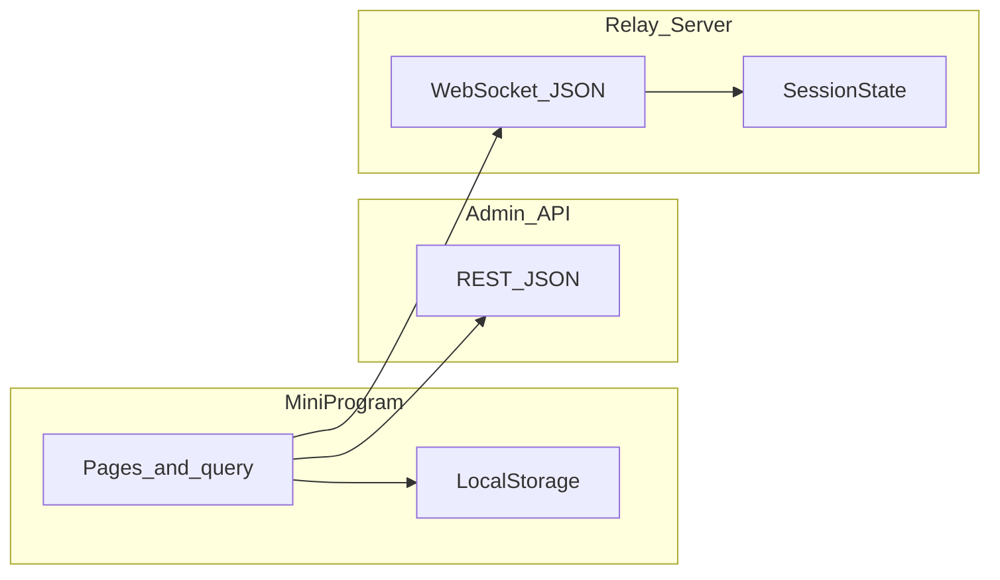

软件工程详细设计说明书

1. 系统概述

1.1 系统简介

简要概述系统的基本情况和背景。

1.2 术语表

定义系统或产品中涉及的重要术语，为读者在阅读文档时提供必要的参考信息。

序号

术语或缩略语

说明性定义

1

PM

Project Manager, 项目经理

2

1.3 系统运行环境

包括对硬件平台、操作系统、数据库系统、编程平台、网络协议等的描述。

1.4 开发环境

列举进行系统分析、程序设计和程序开发时要使用的工程工具和开发语言。应描述每一工具软件的名称、版本等。

2. 数据结构说明

本章说明本程序系统中使用的常量、跨页面或持久化变量，以及程序侧与通信协议侧的核心数据结构。**业务数据在管理后台数据库中的表结构、字段约束与索引设计见第 5 章《数据库设计》，本章不重复展开物理表。**

本系统为微信小程序（uni-app），教师端业务数据主要通过 HTTP 访问管理后台；训练大屏遥控通过独立 **relay-server**（WebSocket）同步房间状态。持久化以微信本地存储为主，**无用户可见的独立数据文件路径**（非文件型持久化）。

### 2.1 常量

| 名称 / 类别 | 含义 | 典型取值或位置 | 说明 |
| --- | --- | --- | --- |
| 管理后台 API 根路径 | 各页面请求的管理端前缀 | 代码中多为 `http://…:48080/admin-api`（如 `pages/index/index.vue`、`pages/me/me.vue`、`pages/screen-control/screen-control.vue`、`pages/training-plan/training-plan.vue` 等） | **部署时以实际环境为准**；各页目前分散定义，可后续收敛为统一配置模块。 |
| 认证相关路径 | 登录与注册 | `{BASE}/system/auth/login`、`{BASE}/system/auth/teacher-register` | `pages/index/index.vue` |
| 用户信息路径 | 拉取当前用户资料 | `GET {BASE}/system/user/profile/get` | `pages/me/me.vue` |
| HTTP 请求头 `Tenant-Id` | 多租户标识 | 固定字符串 `'1'` | 与后台约定一致。 |
| HTTP 请求头 `Authorization` | 访问令牌 | `Bearer ` + `token` 本地存储值 | 需登录的接口均携带。 |
| HTTP 请求头 `content-type` | 注册/登录 POST 体 | `application/json` | `pages/index/index.vue` |
| 接口成功码 `code` | 业务是否成功 | 数值 `0` 表示成功 | 与 `uni.request` 回调中 `res.data.code` 判断一致。 |
| 动作识别服务根地址 | 动作识别算法 HTTP 服务 | `ACTION_RECOGNITION_BASE_URL`（如 `http://10.101.166.129:8000`） | `services/examRecognition.js`，部署可替换。 |
| 动作识别分析路径 | 上传视频分析接口路径 | `/api/v1/forehand-clear/analyze-video` | 与上项拼接为完整 URL。 |
| 考核类型到算法键映射 | 业务考核项对应算法通道标识 | `landing` → `landing_detection`；`action_recognition` → `action_recognition`；其他 → `unknown` | 函数 `mapExamTypeToAlgorithm`。 |
| 中继 WebSocket 默认地址 | 小程序遥控端默认连接 | `ws://127.0.0.1:3456` | `pages/screen-control/screen-control.vue`，可改为局域网 IP。 |
| 中继服务监听端口 | Node relay-server 监听 | 环境变量 `PORT`，缺省 `3456` | `relay-server/src/index.ts` |
| 本地存储键 `token` | 登录后访问令牌 | 字符串，由登录接口 `accessToken` 写入 | `uni.setStorageSync('token', …)` |
| 本地存储键 `userInfo` | 教师用户资料缓存 | 对象，由 `/system/user/profile/get` 的 `data` 写入 | `pages/me/me.vue` |
| 本地存储键 `relayWs` | 上次成功连接的中继 WS 地址 | 字符串 | `pages/screen-control/screen-control.vue` 连接成功后写入 |

**训练计划 / 训练项目界面枚举（与表单整型取值对应，`pages/training-plan/training-plan.vue`）**

| 常量含义 | 数组 / 取值 | 取值说明 |
| --- | --- | --- |
| 计划类型文案 | `planTypeOptions`：`['常规','专项','测试']` | 表单字段 `planType` 取 `1`～`3`，与数组下标 `planType - 1` 对应。 |
| 难度文案 | `difficultyOptions`：`['简单','中等','困难']` | `difficulty` 取 `1`～`3`。 |
| 项目类型文案 | `itemTypeOptions`：`['基础训练','强化训练','考核项目']` | `itemType` 取 `1`～`3`。 |
| 新建计划默认时长等 | `createForm` 初始 `duration: 90`，`status: 0` | `status` 等业务含义以接口文档为准。 |
| 新建项目默认 | `projectForm` 初始 `duration: 20`，`score: 100`，`sortOrder: 1` | 同上。 |

### 2.2 变量

本章区分三类：**路由查询参数**（跨页面、非持久化）、**本地存储变量**（跨页面、持久化）、**页面内响应式状态**（单页生命周期内有效）。

**（1）路由查询参数（exam-setup → exam-session → exam-active）**

| 参数名 | 含义 | 类型约定 | 传递说明 |
| --- | --- | --- | --- |
| `courseId` | 课程 ID | 整数 | `exam-setup` 跳转 `exam-session` 时携带。 |
| `classId` / `class_id` | 班级 ID | 整数 | 兼容两种键名读取。 |
| `className` / `class_name` | 班级名称 | 字符串，URL 编码 | 展示用。 |
| `lessonId` / `lesson_id` | 课堂（课次）ID | 整数 | 考核与课次绑定。 |
| `lessonWeek` / `lesson_week` | 周次 | 整数 | `exam-setup` 的 `onLoad` 可选。 |
| `venueId` | 场地编号 | 字符串 | 与场地列表 `id` 一致。 |
| `venueLabel` | 场地展示行 | 字符串，URL 编码 | 如「1号场地 · 体育馆A区」。 |
| `examType` | 考核项目 | 字符串 | `landing` 或 `action_recognition`。 |
| `classStudentId` | 班级学员关联 ID | 整数 | `exam-session` → `exam-active`。 |
| `studentName`、`studentNo`、`userId` | 学员展示与业务用户 | 字符串，URL 编码 | `exam-session` 选择学员后追加。 |

**（2）本地存储变量**

| 键名 | 读写 API | 内容说明 |
| --- | --- | --- |
| `token` | `uni.getStorageSync` / `uni.setStorageSync` | JWT 或后台下发的访问令牌。 |
| `userInfo` | 同上 | 教师档案对象，与 §2.3 中 `UserProfile` 结构一致。 |
| `relayWs` | 同上 | 最近一次成功加入房间时使用的中继 WebSocket URL。 |

**（3）页面内响应式状态（示例，非全局单例）**

各页使用 Vue `ref` / `reactive` 管理 UI 与请求中间态，例如：`pages/index/index.vue` 的登录/注册表单；`pages/training-plan/training-plan.vue` 的 `lessonList`、`lessonPlans`、`createForm`、`projectForm`；`pages/screen-control/screen-control.vue` 的 `relayWs`、`roomId`、`token`、`socketJoined`、`planIds`、`currentIndex` 等。此类变量不导出为应用级全局变量，**模块间不直接共享引用**，仅通过路由参数、本地存储或接口传递数据。

### 2.3 数据结构

以下为本程序中约定或实现中显式出现的数据结构名称、用途与字段说明（类型以 TypeScript / 业务语义描述为主）。**持久化业务实体在数据库中的定义见第 5 章。**

**（1）管理后台统一响应包（约定）**

| 字段 | 类型 | 说明 |
| --- | --- | --- |
| `code` | number | `0` 成功，非 `0` 失败。 |
| `data` | any | 成功时载荷。 |
| `msg` | string | 提示或错误信息。 |

**（2）登录 / 注册请求体（教师端，`pages/index/index.vue`）**

登录：`{ username, password }`。注册：`{ username, nickname, mobile, password }`。

**（3）用户资料 `UserProfile`（与 `userInfo` 缓存及 `pages/me/me.vue` 对齐）**

| 字段 | 类型 | 说明 |
| --- | --- | --- |
| `id` | number | 用户 ID。 |
| `username`、`nickname`、`avatar`、`mobile`、`email` | string | 账号与展示信息。 |
| `sex` | number | `0` 保密，`1` 男，`2` 女。 |
| `dept` | object \| null | 部门信息。 |
| `roles`、`posts` | array | 元素含 `name` 等，用于展示。 |
| `loginIp`、`loginDate`、`createTime` | string | 登录与注册时间等。 |

**（4）训练计划创建表单 `createForm`（提交前局部结构）**

| 字段 | 说明 |
| --- | --- |
| `planTitle`、`planContent` | 标题与正文。 |
| `planType` | `1` 常规 / `2` 专项 / `3` 测试。 |
| `difficulty` | `1` 简单 / `2` 中等 / `3` 困难。 |
| `duration` | 计划时长（分钟）。 |
| `status` | 与后台约定的状态码，默认 `0`。 |

**（5）训练项目创建表单 `projectForm`**

| 字段 | 说明 |
| --- | --- |
| `itemName`、`itemContent` | 项目名称与要求。 |
| `itemType` | `1`～`3` 对应基础/强化/考核。 |
| `difficulty` | 同计划难度 `1`～`3`。 |
| `duration`、`score`、`sortOrder` | 时长（分钟）、满分、排序。 |

列表展示中的课堂、计划、项目等字段名（如 `courseName`、`weekIndex`、`planTitle`、`itemName`）**以接口实际返回 JSON 为准**。

**（6）中继房间：计划项 `PlanItem`（`relay-server/src/session.ts`）**

| 字段 | 类型 | 说明 |
| --- | --- | --- |
| `id` | string | 当前项唯一标识。 |
| `title` | string | 展示标题。 |
| `durationMin` | number | 本项时长（分钟），服务端用于计算本块倒计时秒数。 |
| `videoUrl` | string（可选） | 教学视频地址。 |
| `instruction` | string（可选） | 文字说明。 |

**（7）中继房间状态 `SessionState`（同上）**

| 字段 | 类型 | 说明 |
| --- | --- | --- |
| `plan` | `PlanItem[]` | 当前房间训练序列。 |
| `currentItemId` | string | 当前激活项 `id`。 |
| `sessionElapsedSec` | number | 会话已进行秒数（未暂停时递增）。 |
| `blockRemainingSec` | number | **当前项**剩余秒数；切换项或 `setPlan` 时一般置为 `durationMin * 60`。 |
| `paused` | boolean | 是否暂停计时。 |
| `videoPlaying` | boolean | 视频是否在播。 |
| `overlaySkeleton`、`overlayError` | boolean | 占位骨架屏 / 错误遮罩开关。 |
| `networkOk`、`systemOk` | boolean | 网络 / 系统健康示意。 |

**（8）WebSocket 线协议消息（`relay-server/src/protocol.ts`）**

客户端 → 服务端 `ClientToServer`：

- `{ type: 'join', role: 'display' | 'mobile', roomId?: string, token?: string }`：加入房间。
- `{ type: 'command', name: string, payload?: Record<string, unknown> }`：下发控制命令。

服务端 → 客户端 `ServerToClient`：

- `{ type: 'joined', roomId, token, role, state }`：加入成功，携带初始 `SessionState`。
- `{ type: 'state', state }`：房间状态广播。
- `{ type: 'error', code, message }`：错误；`code` 如 `already_joined`、`bad_join`、`unauthorized`、`not_joined`、`room_missing`、`bad_command`、`join_timeout`、`bad_json` 等（见 `relay-server/src/index.ts`）。

**（9）命令名 `name` 与 `payload`（与 `parseWireCommand` 一致，`relay-server/src/stateLogic.ts`）**

| `name` | `payload` 要求 | 语义 |
| --- | --- | --- |
| `pause` / `resume` | 无 | 暂停 / 继续计时。 |
| `setCurrentItem` | `{ id: string }` | 切换到指定计划项并重置该项倒计时。 |
| `setItemDuration` | `{ id, durationMin }` | 修改某项分钟数。 |
| `toggleVideo` | 无 | 切换 `videoPlaying`。 |
| `setVideoPlaying` | `{ playing: boolean }` | 设置视频播放状态。 |
| `toggleSkeleton` / `toggleErrorOverlay` | 无 | 切换遮罩。 |
| `resetBlockTimer` | 无 | 将当前项 `blockRemainingSec` 重置为当前 `durationMin * 60`。 |
| `setPlan` | `{ plan: array, currentItemId?: string }` | `plan` 元素经规范化后须满足 `PlanItem` 字段要求；可指定当前项。 |

**（10）小程序侧合并下发结构（`mergePlanPayload`，`pages/screen-control/screen-control.vue`）**

将后台返回的 `projects` 与 `materials` 按 `sortOrder`（或 `id`）排序后，按下标对齐合并为下发给中继的 `PlanItem[]`：`id` ← `String(project.id)`，`title` ← `itemName`，`durationMin` ← `max(1, round(duration))`；若同下标素材存在非空 `videoUrl`、描述类字段则映射为 `videoUrl`、`instruction`。

**（11）考核相关**

- **场地项**（`exam-setup` 内嵌列表）：`{ id, name, location, line }`，`line` 为展示用合成字符串。
- **考核类型**：`{ id: 'landing' | 'action_recognition', title, desc }`。
- **`startRecognition` 入参**（`services/examRecognition.js`）：含 `venueId`、`examType`；动作识别分支可含 `filePath`；其余 `courseId`、`classId`、`classStudentId`、`userId` 等透传供后续绑定接口使用。

**（12）数据流关系（程序视角）**

3. 模块设计

3.1 软件结构

以图形方式给出软件系统的子系统（或软件包）划分，模块划分，子系统间、模块间关系等，并用接口来描述各模块之间的调用关系，给出各模块之间的松散耦合关系。

3.2 功能设计说明

结合上图阐述软件的基本设计思想和理念。

3.3 模块 1

详细描述各功能模块的功能、数据结构、具体算法和流程等。

3.3.1 设计图

（此处插入设计图说明或路径）

3.3.2 功能描述

简要描述模块 1 的业务功能。

3.3.3 输入数据

详细描述用户输入的数据（包括任何输入设备）以及这些数据的有效性检验规则。

详细描述从物理模型中的哪些表获取数据以及获取这些数据的条件。

3.3.4 输出数据

详细描述模块 1 所产生的数据以及这些数据的表现形式。

3.3.5 数据设计

给出本程序中的局部数据结构说明，包括数据结构名称，功能说明，具体数据结构说明（定义、注释设计、取值）等。相关数据库表，数据存储设计（具体说明需要以文件方式保存的数据文件名、数据存储格式、数据项及属性等）。

3.3.6 算法和流程

详细描述根据输入数据产生输出数据的算法和流程。

3.3.7 函数说明

具体说明模块中的各个函数，包括：

函数名称及其所在文件

功能、格式、参数

全局变量、局部变量、返回值

算法说明、使用约束等

3.3.8 全局数据结构与该模块的关系

说明该模块访问了哪些全局数据结构。

3.4 模块 2

（同模块 1 结构）

4. 接口设计

4.1 用户接口

说明将向用户提供的接口。

4.2 外部接口

描述本软件同外界的所有接口，包括软件、硬件、本系统与各支持系统之间的接口关系、控制方式。

4.3 内部接口

4.3.1 接口说明

例如：xx 子模块通过 xx 从 xx 子模块取得 xx 等，相关标准，调用示例。

4.3.2 调用方式

示例代码：

/**
 * 通过用户服务号码取得该客户认证密码等信息
 * @param userNo 用户服务号码
 * @return RUserInfo 客户信息，如果该客户存在返回为0，其他情况参考错误编码
 */
public RUserInfo getUserInfo (String userNo);

5. 数据库设计

描述所使用的数据库系统，及数据库和数据表设计。如果系统不以数据库方式存储数据则可省略。

6. 系统出错处理

6.1 出错信息

用一览表的方式说明每种可能的错误和故障，以及系统输出信息的形式、含义和处理方式。

6.2 补救措施

说明故障出现后可能采取的补救措施，如恢复、再启动技术等。

7. 其他设计

如系统安全设计、性能设计等。